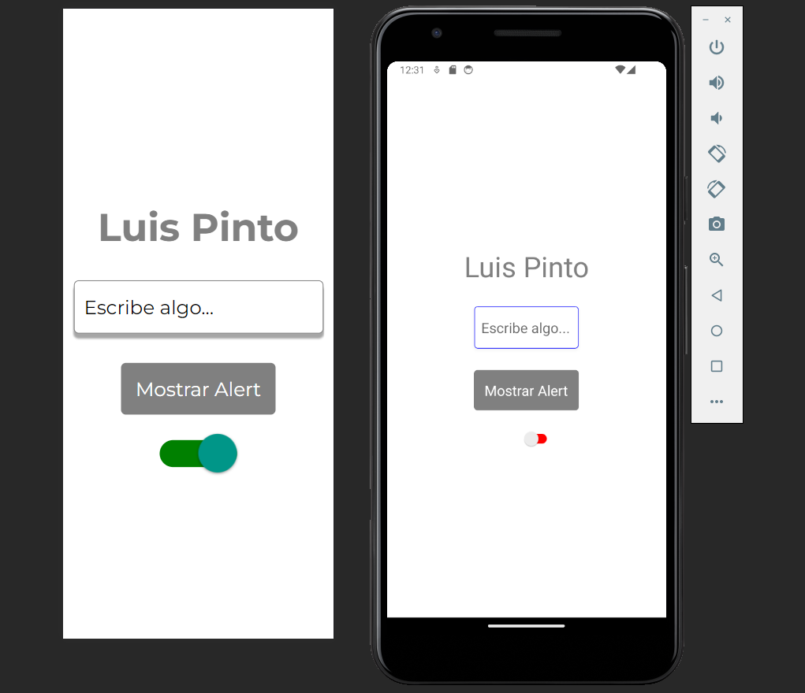
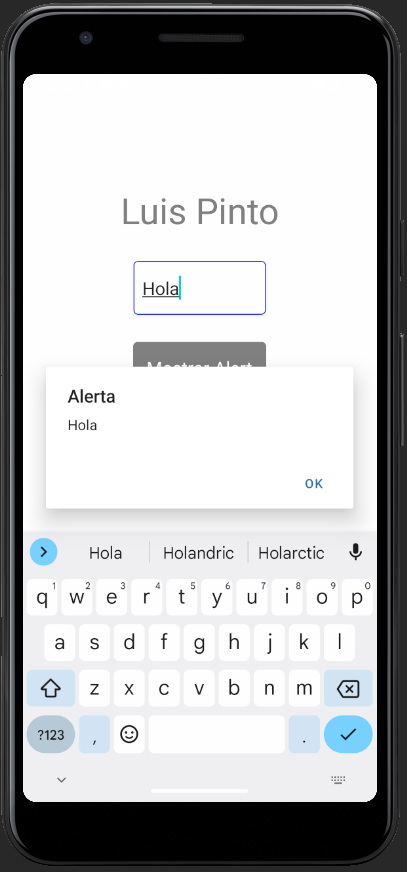
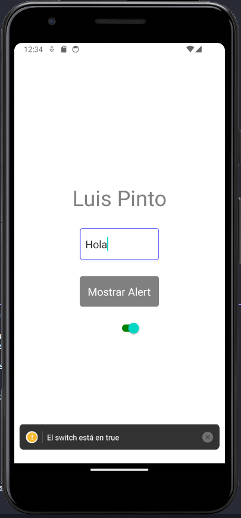

# Practica R1 - Text input y Alert en React Native

### Vista en Web y Móvil

## Alerta

Al hacer click sobre el botón muestra lo que hay en el input

## Cambio de Estado al Usar el Switch

Al hacer uso del switch este cambia de color de rojo a verde, o viceversa, alertando esto con un console.warn()

